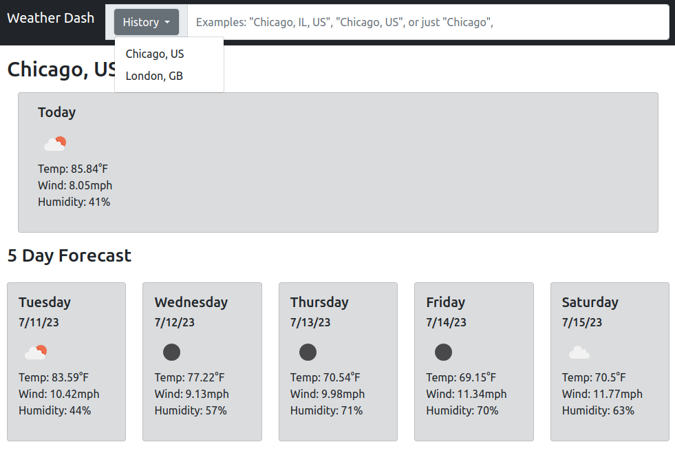

# Weather Dashboard

## Screenshot

## Links
GitHub: https://github.com/Yoonbacca/weather-dashboard

Live Page: https://yoonbacca.github.io/weather-dashboard

## Description
This is a simple weather forecast app created from scratch. The purpose of this app was to practice using third-party APIs to create a more robust web app. The app has a search function with a search history dropdown menu that the user can use to interact with the site.

On a fresh run of the page, the location will default to Chicago, IL. If the local storage has at least one location saved, it will instead load the most recent search. Users can also use the History dropdown menu to select a previous location to search as well. By default, if nothing is in local storage, it will only display text that says 'None'.

There is a large main card and 5 smaller forecast cards built out and formatted using Bootstrap. Each of these contain the current day/date (pulled from DayJS), a descriptive weather icon, the temp, wind speed, and humidity in US Imperial units. I plan on adding a switch to convert to Celcius in the future. I can add many more features to this page in the future, such as air quality reports, as well as high/low temps as well.

## How to Install and Run the Project 
You can either clone the repo and preview index.html within an IDE or access the page at https://yoonbacca.github.io/weather-dashboard

## How to Use the Project
Use this project to learn more about the weather from any location

## Credits
This project uses jQuery, DayJS, and the OpenWeather API. All code by Yoon-Jae Kim. Techniques learned from NW Coding Bootcamp.
